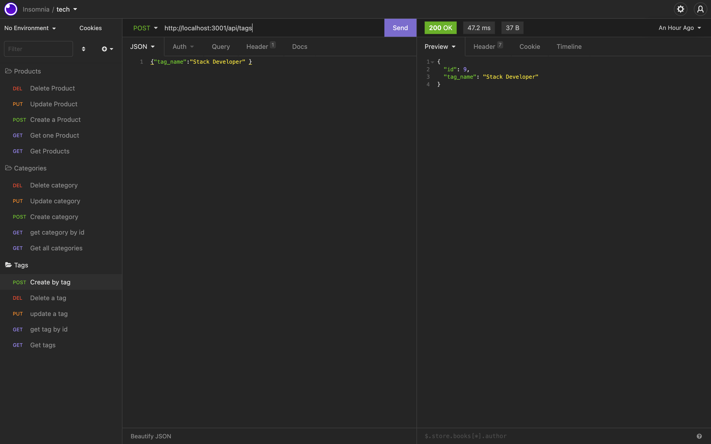

# E-commerce Backbone
 ## Table of Contents
  * [Description](#description)
  * [Installation](#installation)
  * [Usage](#usage)
  * [Test](#test)
  * [Contributor](#contributor)
  * [Help](#help)
  * [License](#license)
  * [Questions](#questions)
  
  ## Description
  Build the back end for an e-commerce site. Take a working Express.js API and configure it to use Sequelize to interact with a MySQL database.

  ## Installation
   Follow these steps to install this application :-   
   ```npm i inquirer``` ,
   ``` npm install mysql2``` ,
   ``` npm install dotenv```&
   `npm i sequelize `

   ## Usage
  
  Keep track of e-commerce database using back-end.
  Create the .env file and include DB_PW="your root password" & DB_NAME= emptracker_db. then type ```node server.js``` or ```npm start```to execute the app.

## Deployed link
 `Video link`
  https://drive.google.com/file/d/1v_HgiMROq8d2AvOFRTWSEZG65kEXwcIy/view:  

## Screenshot
  `Sample pic`

  
## Contribute?
Any additional parameters you would like to add can be submitted for review.

## Help
I got a help from AskBCS , some from module and google(https://www.google.com)
  
# License

This project is licensed under the [The Unlicense](https://choosealicense.com/licenses/unlicense/).

## Questions
  If you have any question or concern contact me at pawanpreetkaur495@gmail.com.  

  Follow me on Github at  https://github.com/pawan495


 


 
